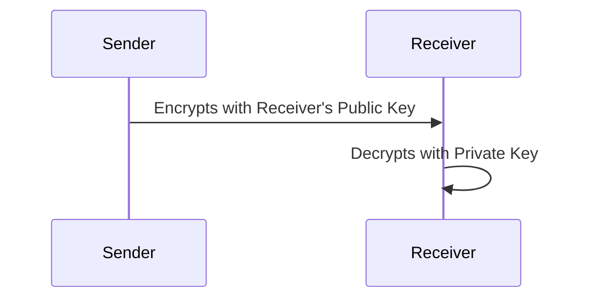

Here is your Cryptography Cheat Sheet, structured with clear explanations, Mermaid diagrams, and concise descriptions of key concepts.

⸻

Cryptography Cheat Sheet

1. Encryption vs Hashing vs Encoding

Cryptography involves different methods for securing and transforming data. The three main categories are:

Feature	Hashing (MD5, SHA-512)	Encryption (AES, RSA)	Encoding (Base64, Hex)
Purpose	Verify integrity	Confidentiality	Data transformation
Reversible?	No (One-way)	Yes (With Key)	Yes (Decodable)
Key Used?	No Keys	Public/Private Key	No Keys
Examples	MD5, SHA-256	AES, RSA	Base64, Hex
Use Case	File integrity, Passwords	Secure communication	Data transport

Mermaid Diagram: Hashing vs Encryption vs Encoding

```mermaid
graph TD;
    A[Plain Data] -->|Hashing| B[Hashed Value (Fixed Length)];
    A -->|Encryption (Key Required)| C[Encrypted Data];
    C -->|Decryption (Key Required)| A;
    A -->|Encoding| D[Encoded Data (Readable)];
    D -->|Decoding| A;
```


⸻

2. Symmetric vs Asymmetric Encryption

Encryption is categorized into symmetric and asymmetric methods.

Symmetric Encryption (AES, ChaCha20)
	•	Same key is used for encryption and decryption.
	•	Faster but requires a secure key exchange.
	•	Used in file encryption, databases, VPNs.

sequenceDiagram
    participant Sender
    participant Receiver
    Sender->>Receiver: Sends Encrypted Data
    Sender-->>Receiver: Shares Secret Key Securely
    Receiver->>Receiver: Decrypts with Same Key

Asymmetric Encryption (RSA, ECC)
	•	Public key encrypts, private key decrypts.
	•	Slower but removes the need for secure key exchange.
	•	Used in HTTPS, PGP, Digital Signatures.




⸻

3. Hashing (SHA-256, MD5)
	•	One-way function, cannot be reversed.
	•	Used for password storage, data integrity, digital signatures.

```mermaid
graph TD;
    X[Input Data] -->|Hash Function| Y[Fixed-length Hash Output];
```mermaid

Example:

echo "hello" | sha256sum


⸻

4. Principles of Secure Encryption

Key Principles
	1.	Confidentiality – Data is accessible only to authorized parties.
	2.	Integrity – Data has not been altered.
	3.	Authentication – Verifying the identity of users/systems.
	4.	Non-repudiation – Prevents denial of actions.

Key Terms

Term	Definition
Cipher	Algorithm for encryption and decryption
Key Pair	Public and private keys in asymmetric encryption
Salt	Random value added to a hash to increase security
IV (Initialization Vector)	Random data used to ensure uniqueness
HMAC	Hash-based authentication code for integrity


⸻

5. Common Cryptography Commands

Command	Purpose
openssl rand -hex 16	Generate a random key
openssl genpkey -algorithm RSA -out key.pem	Generate RSA key
openssl enc -aes-256-cbc -salt -in file.txt -out file.enc	Encrypt a file
openssl enc -aes-256-cbc -d -in file.enc -out file.txt	Decrypt a file
`echo “hello”	sha256sum`
`echo “hello”	base64`
`echo “aGVsbG8=”	base64 –decode`


⸻

This provides an overview of cryptography concepts, algorithms, and commands. Let me know if you need modifications.                

⸻

🛡️ Cryptography Cheat Sheet 🔑

🚀 Quick Reference for Encryption, Hashing, and Encoding

⸻

🔥 1. Key Differences: Hashing vs. Encryption vs. Encoding

Feature	Hashing (MD5, SHA-512) 🔄	Encryption (AES, RSA) 🔐	Encoding (Base64, Hex) 📝
Purpose	Data integrity	Confidentiality	Data transformation
Reversible?	❌ No (One-way)	✅ Yes (With Key)	✅ Yes (Decodable)
Key Used?	❌ No Keys	✅ Public/Private Key	❌ No Keys
Examples	MD5, SHA-256	AES, RSA	Base64, Hex
Use Case	Verify integrity	Secure communication	Convert binary to text


⸻

🔑 2. Public vs. Private Key Cryptography (Asymmetric Encryption)

Public Key Cryptography (RSA, ECC)

🔓 Public Key → Encrypts Data
🔒 Private Key → Decrypts Data

📌 Used in: SSL/TLS, Digital Signatures, PGP Encryption

💡 Diagram:
```mermaid
Sender → (Public Key) → 🔒 Encrypted Message → (Private Key) → Receiver (Decrypted)
```
🔹 Example Command:
```
openssl genpkey -algorithm RSA -out priv.pem
openssl pkey -in priv.pem -pubout -out pub.pem
```


⸻

🔐 3. Symmetric Encryption (AES, DES, ChaCha20)

How it Works

✅ Same Key for Encryption & Decryption
📌 Used in: File Encryption, Secure Storage

💡 Diagram:

Sender → (Secret Key) → 🔒 Encrypted Message → (Secret Key) → Receiver (Decrypted)

🔹 Example Command:
```sh
openssl enc -aes-256-cbc -salt -in file.txt -out file.enc
openssl enc -aes-256-cbc -d -in file.enc -out file.txt
```


⸻

🔄 4. Hashing Algorithms (SHA, MD5, BLAKE2)

💡 How it Works:
📌 Fixed-length output from any input
❌ Cannot be reversed
✅ Used for checksums, password hashing, and digital signatures

💡 Diagram:

Input Data → [Hash Function] → Unique Hash

🔹 Example Command:

echo "hello" | sha256sum
openssl dgst -sha512 file.txt

⚠️ MD5 is outdated and insecure! Use SHA-256 or better!

⸻

📝 5. Encoding (Base64, Hex)

📌 Just for Representation, NOT Security!

💡 Diagram:
```mermaid
Binary Data → [Encoding] → Text Representation → [Decoding] → Original Data
```
🔹 Example Command:

echo "hello" | base64
echo "aGVsbG8=" | base64 --decode


⸻

🛠️ 6. Essential Cryptography Commands

Command	Purpose
openssl rand -hex 16	Generate a random key
openssl genpkey -algorithm RSA -out key.pem	Generate RSA key
openssl enc -aes-256-cbc -salt -in file.txt -out file.enc	Encrypt a file
openssl enc -aes-256-cbc -d -in file.enc -out file.txt	Decrypt a file
`echo “hello”	sha256sum`
`echo “hello”	base64`
`echo “aGVsbG8=”	base64 –decode`


⸻

🏷️ 7. Must-Know Cryptography Terms

Term	Definition
Cipher	Algorithm for encryption/decryption (AES, RSA, etc.)
Key Pair	Public and private keys used in asymmetric encryption
Salt	Random data added to a hash to prevent dictionary attacks
IV (Initialization Vector)	Random value to ensure unique ciphertexts
HMAC	Hash-based Message Authentication Code for data integrity
TLS/SSL	Secure communication protocols (HTTPS)
PGP	Email encryption using public/private keys
Checksum	A hash used to verify file integrity


⸻

🎯 Final Tip: Always use strong encryption methods (AES-256, RSA-4096) and avoid outdated algorithms (MD5, DES). 💪

Would you like any modifications or extra details? 🚀